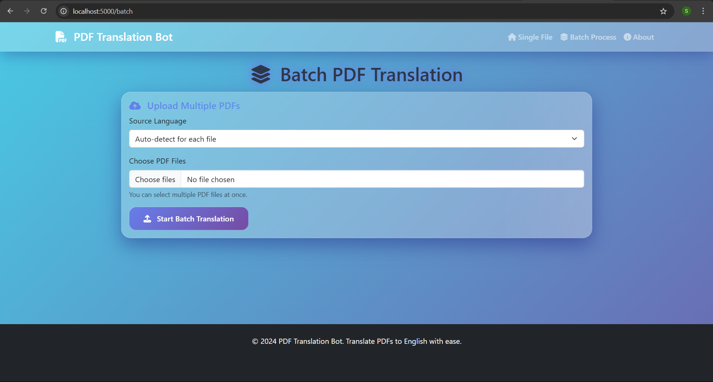

# PDF Translation Bot - Web Application

A modern, responsive web application for translating PDF documents from multiple languages to English using AI-powered translation services.

## Features

- 🌍 **Multi-language Support**: Supports 15+ languages including Finnish, French, Spanish, German, Italian, Portuguese, Russian, Chinese, Japanese, Korean, and more
- 🤖 **Auto-detection**: Automatically detects the source language of PDF documents
- 📁 **Batch Processing**: Upload and translate multiple PDF files simultaneously
- 📱 **Responsive Design**: Works seamlessly on desktop, tablet, and mobile devices
- ⚡ **Real-time Progress**: Live progress updates using WebSocket technology
- 🔄 **Background Processing**: Non-blocking translation processing
- 📥 **Drag & Drop**: Intuitive file upload with drag and drop support

## Screenshots




## Quick Start

### Option 1: Docker (Recommended)

1. **Clone the repository**:
   ```bash
   git clone <your-repo-url>
   cd pdf-translator-bot/webapp
   ```

2. **Build and run with Docker Compose**:
   ```bash
   docker-compose up --build
   ```

3. **Access the application**:
   Open your browser and navigate to `http://localhost:5000`

### Option 2: Local Development

1. **Prerequisites**:
   - Python 3.9+
   - pip

2. **Install dependencies**:
   ```bash
   pip install -r requirements.txt
   ```

3. **Copy the PDF translator module**:
   ```bash
   cp ../pdf_translator.py .
   ```

4. **Create directories**:
   ```bash
   mkdir uploads downloads
   ```

5. **Run the application**:
   ```bash
   python app.py
   ```

6. **Access the application**:
   Open your browser and navigate to `http://localhost:5000`

## Configuration

### Environment Variables

- `SECRET_KEY`: Flask secret key (change in production)
- `FLASK_ENV`: Set to `production` for production deployment
- `MAX_CONTENT_LENGTH`: Maximum file size (default: 50MB)

### Production Deployment

For production deployment, consider:

1. **Use a production WSGI server** (Gunicorn is included)
2. **Set a secure secret key**
3. **Use environment variables** for sensitive configuration
4. **Set up reverse proxy** (Nginx recommended)
5. **Enable HTTPS**
6. **Configure logging**

## API Endpoints

- `GET /` - Main page (single file upload)
- `GET /batch` - Batch processing page
- `POST /upload` - Upload and translate files
- `GET /download/<filename>` - Download translated files
- `GET /status/<task_id>` - Get translation status
- `GET /api/languages` - Get supported languages
- `GET /about` - About page

## File Structure

```
webapp/
├── app.py                 # Main Flask application
├── requirements.txt       # Python dependencies
├── Dockerfile            # Docker configuration
├── docker-compose.yml    # Docker Compose configuration
├── templates/            # HTML templates
│   ├── base.html
│   ├── index.html
│   ├── batch.html
│   ├── about.html
│   ├── 404.html
│   └── 500.html
├── static/               # Static assets
│   ├── css/
│   │   └── style.css
│   └── js/
│       └── app.js
├── uploads/              # Uploaded files (created at runtime)
└── downloads/            # Translated files (created at runtime)
```

## Technology Stack

- **Backend**: Flask, Python
- **Frontend**: Bootstrap 5, JavaScript
- **Real-time**: Socket.IO
- **Translation**: Google Translate API
- **PDF Processing**: PyPDF2, ReportLab
- **Deployment**: Docker, Gunicorn

## Browser Support

- Chrome 90+
- Firefox 88+
- Safari 14+
- Edge 90+

## Contributing

1. Fork the repository
2. Create a feature branch
3. Make your changes
4. Add tests if applicable
5. Submit a pull request

## License

This project is licensed under the MIT License - see the LICENSE file for details.

## Support

If you encounter any issues or have questions:

1. Check the [Issues](../../issues) page
2. Create a new issue with detailed information
3. Include error logs and system information

## Changelog

### v1.0.0 (2024)
- Initial release
- Single file and batch translation
- Multi-language support
- Web interface with real-time progress
- Docker deployment support

## Roadmap

- [ ] User authentication system
- [ ] Translation history
- [ ] API rate limiting
- [ ] Multiple output formats
- [ ] OCR support for image-based PDFs
- [ ] Cloud storage integration

---

Made with ❤️ for seamless PDF translation
